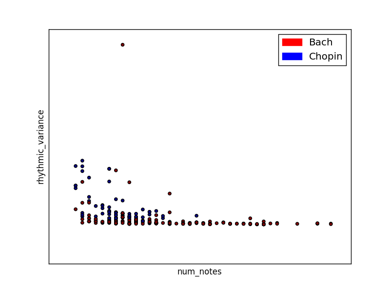
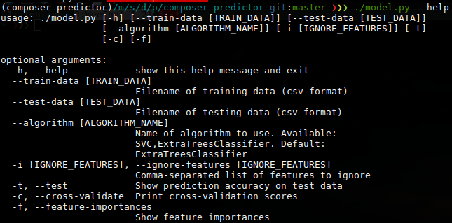

# Composer Predictor
#####Northwestern University - Machine Learning (EECS 349)
######Sean Yeh, seanyeh2014 [at] u.northwestern.edu
######Paul Juhn, pauljuhn2014 [at] u.northwestern.edu

### About
Our attempt to use machine learning to predict the composer of a musical piece.

### Synopsis

Our task is to predict the composer of melodic fragments of musical pieces based on previous data from those specific composers.This task is important to see if similarities exist between composers and if they do, what makes them similar. On the other hand, we can also see what features makes a composer unique, which allows us to categorize that melody. There have also been times in history where a piece of classical music surfaces and the composer is unknown. With enough data, our composer predictor could classify such unknown works and give credit where it’s due.

We first took many midi files of pieces and wrote a script that separates them into short melodic fragments. This way we have multiple data examples from a smaller number of larger works. There are a few downsides with this approach, such as repetitions in the music or generic fragments that don’t carry enough information about the composer. However, for this class, we decided to keep the scope small and manageable. We then analyzed the melodic fragments for various features, such as rhythmic variance, melodic leaps, chromaticism, and range. We separated the data into a training and testing set (70/30 split) and measured our success on the percentage of melodic fragments predicted correctly.

Our results were fairly successful, but that was not too surprising given the small scope of our project. We only looked at two composers, Bach and Chopin, who are quite different. However, our program is written without hardcoding the number of composers, and it is quite trivial to add more pieces. All that is needed is to create a new folder of the composer’s name in the raw data directory and add MIDI files.

(A look at two features)

[Detailed report](ComposerPredictorWriteup.pdf)

### Requirements
- Python 3+
- Various 3rd party libraries (see requirements.txt. Install with `pip install -r requirements.txt`)

### Basic Steps

1. Split each raw data file into multiple examples by running `./preprocess.py`. (this only needs to be run once, but no harm in running multiple times). The resulting data will be stored in `data/preprocessed/`
2. Evaluate features on each example by running `./generate.py`. This will store the results into two csv files: one for training and the other for testing
3. Create model and show prediction accuracy on testing data and/or show cross-validation scores by running `./model.py` with the `--test` and/or the `--cross-validation` flags. Feature importances can be shown with `--feature-importances` and you can change the machine learning algorithm with `--algorithm`

As always, you can always run any of these files with the `--help` flag for more information.

